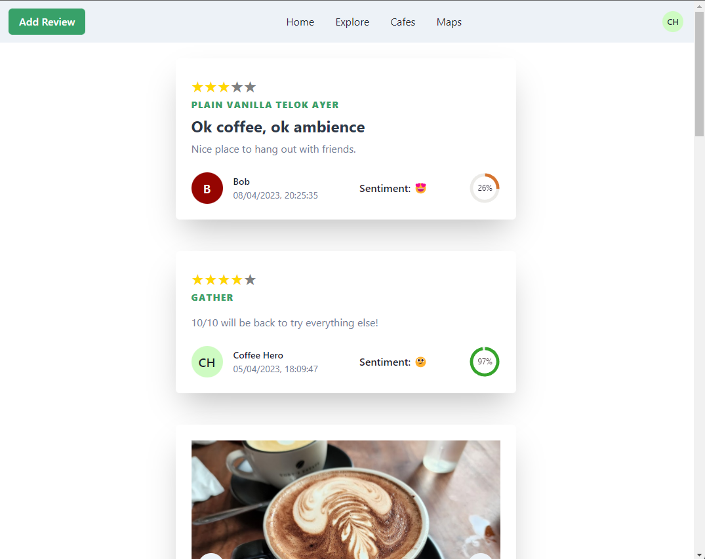

# Cafenaut



An all-in-one cafe review platform for _CS4242 Social Media Computing_. Built on **ReactJs** and **NestJs**, the aim of this application is to fulfil the
needs of cafe-goers in finding the most reliable and authentic cafes through reviews.

For a more detailed explanation on the feature set and technologies used,
view our presentation slides and report document: [G5-PPT.pdf](doc/G5-PPT.pdf), [G5-Report.pdf](doc/G5-Report.pdf)

## Setup

Run `npm i --legacy-peer-deps` to install all dependencies of the monorepo.

Populate Firebase required files:

1. For frontend, create a `apps\frontend\.env` file and enter the required fields of Firebase Authentication:
    ```
   VITE_API_KEY=
   VITE_AUTH_DOMAIN=
   VITE_PROJECT_ID=
   VITE_STORAGE_BUCKET=
   VITE_MESSAGING_SENDER_ID=
   VITE_APP_ID=
   VITE_MEASUREMENT_ID=
   ```
2. For backend, create and download a GCP service account JSON with permissions for Firestore, and place it
   in `apps\backend\src\auth\firebaseServiceAccount.json`.
3. To start up application, run `npx nx run-many --parallel --target=serve --projects=frontend,backend `

## Development frontend client

Run `npx nx serve frontend` for a dev server. Navigate to http://localhost:3333/. The app will automatically reload if
you change any of the source files.

## Development backend server

Run `npx nx serve backend` for a dev server. Navigate to http://localhost:4200/. The app will automatically reload if
you change any of the source files.
